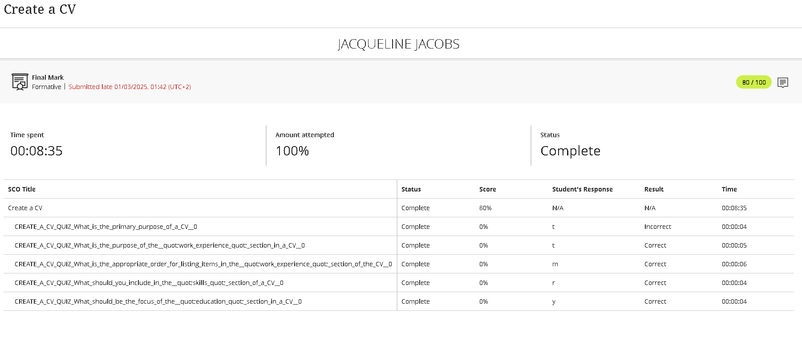

# Digital-Portfolio

## Career Counselling

### Evidence

### STAR Reflection
**S – Situation:**  I attended and completed an online lesson to guide and help plan a successul career using methods like the SMART goals.

**T – Task:**  The goal was to define my career and development plan but first I had to understand the concepts of career planning. 

**A – Action:** I refected on my career interests and made use of the SMART goal method to set clear goals for myself.

**R – Result:** By the end of the lesson, I had a clear and well-structed action plan and understood that to achieve this I had to take responsiblity for my own growth.

## Skills & Interests

### Evidence

### STAR Reflection
**S – Situation:**   This lesson helped me explore my skills and interest and how it needs to match my career path in ICT.

**T – Task:**   I had to identify my skills and interest to guide me with my career direction.

**A – Action:**   During the lessons ,I completed assessments that help me make a list of skills and interests to find suitable career roles and job opportunities in the IoT world.

**R – Result:** This lesson made me realize how my skills and interest aligns with the career path I decide to go with and where I will thrive best.

## Personality Assessment

### Evidence

### STAR Reflection
**S – Situation:**  As part of this lesson on personality assessment,I completed an assessment to understand how my traits affects my career choices.

**T – Task:** I have to figure out my personality types are and how it supports careers in ICT.   

**A – Action:**   After completing these assessments I learned that I have a personality types that enjoys problem-solving and clear communication ,traits suitable for technical roles.

**R – Result:** This lesson pointed out areas for improvement as well as suitable career rols in Networking.

## Create A CV

### Evidence

### STAR Reflection
**S – Situation:** This online lesson helped prepare for job applications in the ICT field.It guided me to create a CV that reflects not only my personal background but also my skills,educational background and my experiences.

**T – Task:** To Create a well-structed CV using the correct formatting and presentation.

**A – Action:** I gathered the needed documentation.i used a professional CV template that included all needed sections such as education and work experience.

**R – Result:** I feel more  cstrong onfident in applying for jobs now that I have a CV that presents a strong profile representing me when applying for jobs or interships.

## CV Submission

### Evidence

### STAR Reflection
**S – Situation:**  After completing the online lesson, Create a cv, I was required to submit my CV that I created with the guidence from the lesson as part this whole experience of career readiness.

**T – Task:** I had to  submit a completed cv ,including certificates and identification documents as if its for a job. Every detail had to meet the criteria from the CV review brief.

**A – Action:** I submited my CV after checking it one last time for any errors.Then saved it as a PDF to keep the layout as is. The CV is uploaded into my GitHub Respository,and a screenshot was added into my README.md as proof of my submission and for visual reference.

**R – Result:** A Successful submission of my cv completes my online lessons for getting myself ready for the work world. This experience improved my ability to present myself in a professional manner while getting ready to go into the real world. 
