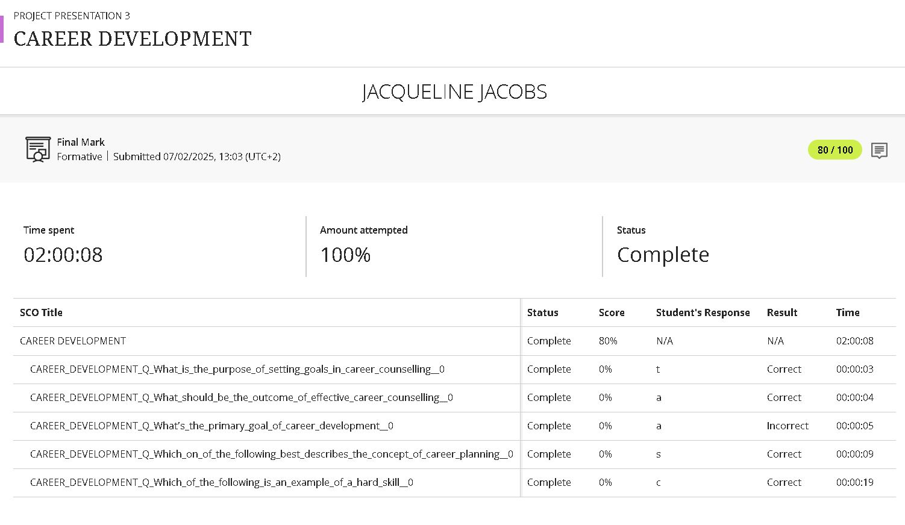
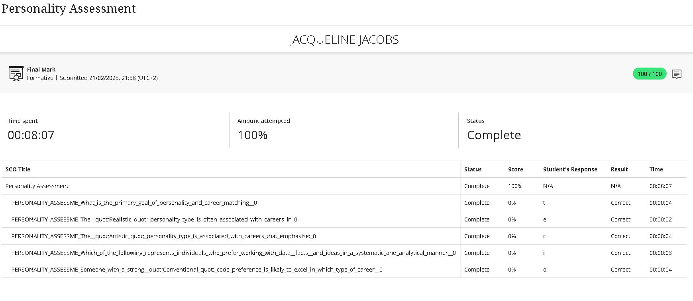

# Digital-Portfolio

## Career Counselling

### Evidence

### STAR Reflection
**S – Situation:**  I attended and completed an online lesson to guide and help plan a successul career using methods like the SMART goals.
**T – Task:**  To define my career and development plan but not before understanding the concepts of career planning. 
**A – Action:**   Reflecting on my career interests and setting SMART goals.
**R – Result:** At the end of the lesson, i had a clear sight of my action plan and that to achieve this I had to take responsiblity for my own growth.

## Skills & Interests

### Evidence

### STAR Reflection
**S – Situation:**   
**T – Task:**   
**A – Action:**   
**R – Result:** 

## Personality Assessment

### Evidence

### STAR Reflection
**S – Situation:**   
**T – Task:**   
**A – Action:**   
**R – Result:** 

## Create A CV

### Evidence

### STAR Reflection
**S – Situation:**   
**T – Task:**   
**A – Action:**   
**R – Result:** 

## CV Submission

### Evidence

### STAR Reflection
**S – Situation:**   
**T – Task:**   
**A – Action:**   
**R – Result:** 
