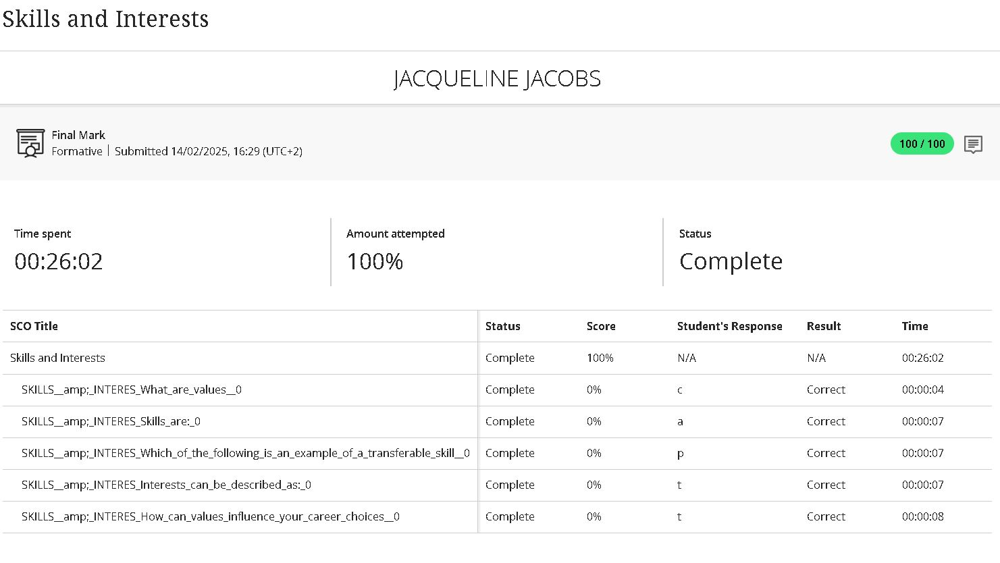

# Digital-Portfolio

## Career Counselling

### Evidence

### STAR Reflection
**S – Situation:**  I attended and completed an online lesson to guide and help plan a successul career using methods like the SMART goals.

**T – Task:**  To define my career and development plan but not before understanding the concepts of career planning. 

**A – Action:**   Reflecting on my career interests and setting SMART goals.

**R – Result:** At the end of the lesson, i had a clear sight of my action plan and that to achieve this I had to take responsiblity for my own growth.

## Skills & Interests

### Evidence

### STAR Reflection
**S – Situation:**   Thislesson helped me explore my skills and interest and how it needs to match my career path in ICT.

**T – Task:**   Identifying my skills and interest helped with reflecting and guiding my career decisions.

**A – Action:**   During the lessons ,i completed assessments that help me make a list of skills and interests to find suitable career roles and job opportunities in the IoT world.

**R – Result:** This lesson made me realize how my skills and interest aligns with the career path i decide to go with and where i will thrive best.

## Personality Assessment

### Evidence

### STAR Reflection
**S – Situation:**  As part of this lesson on personality assessment,i completed an assessment to understand how my traits affects my career choices.

**T – Task:** figuring  out what my personality types are and how it supports careers in ICT.   

**A – Action:**   After completing these assessments i learned that i have a personality types that enjoys problem-solving and clear communication ,traits suitable for technical roles.

**R – Result:** This lesson pointed out areas for improvement as well as suitable career rols in Networking.

## Create A CV

### Evidence

### STAR Reflection
**S – Situation:** This online lesson helped prepare for job applications in the ICT field.It guided me to create a CV that reflects not only my personal background but also my skills,educational background and my experiences.

**T – Task:** To Create a well-structed CV using the correct formatting and presentation.

**A – Action:** I gathered the needed documentation.i used a professional CV template that included all needed sections such as education and work experience.

**R – Result:** I feel more  cstrong onfident in applying for jobs now that i have a CV that presents a strong profile representing me when applying for jobs or interships.

## CV Submission

### Evidence

### STAR Reflection
**S – Situation:**  After completing the online lesson, Create a cv, i was required to submit my CV that i created with the guidence from the lesson as part this whole experience of career readiness.

**T – Task:** I had to  submit a completed cv,including certificates and identification documents as if its for a job. Every detail had to meet the criteria from the CV review brief.

**A – Action:** I submited my CV after checking it one last time for any errors.Then saved it as a PDF to keep the layout as is. The CV is uploaded into my GitHub Respository,and a screenshot was added into my README.md as proof of my submission and for visual reference.

**R – Result:** A Successfulsubmission of my cv completes my online lessons for getting myself ready for the work world. This experience improved my ability to present myself in a professional manner while getting ready to go into the real world. 
